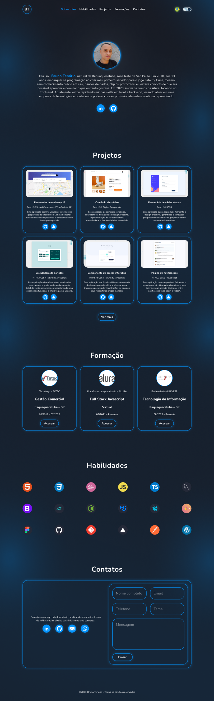

# Meu Portfólio

## Bem-vindo! 👋

Bem-vindo ao meu Portfólio! Este projeto, desenvolvido com React.js, TypeScript, Styled Components e Recoil, apresenta diferentes seções que destacam minhas habilidades, projetos, formações e informações de contato.

## Seções do Projeto

O projeto possui várias seções, incluindo:

- **Sobre Mim**: Uma breve descrição sobre mim e meus objetivos profissionais.
- **Habilidades**: Destaca minhas habilidades em diversas linguagens e ferramentas.
- **Projetos**: Exibe detalhes sobre alguns dos projetos que desenvolvi.
- **Formação**: Detalhes sobre minha formação.
- **Contato**: Opções para entrar em contato comigo, seja por formulário ou redes sociais.

## Visualização do Projeto

Para visualizar o projeto em sua totalidade, incluindo detalhes de todas as seções, você pode acessar a página hospedada no Vercel. Basta clicar no link disponível no canto direito, abaixo de "About" nesse repositório.

Sinta-se à vontade para explorar mais sobre meu Portfólio!
